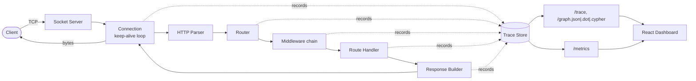

# ExplainHTTP

**An HTTP/1.1 server built from scratch in Python that explains exactly how it
handles every request.**

[](https://github.com/eshitarai27/ExplainHTTP-An-Explainable-HTTP-Server-with-Request-Provenance/actions/workflows/ci.yml)
[](LICENSE)
[](backend/requirements.txt)

No Flask. No FastAPI. No Django. Just `socket`, threading, and the rest of
the standard library -- plus a full explainability layer on top: every
request gets a trace ID, every pipeline stage (parsing, routing, middleware,
handler, response) is timed and recorded, and the whole thing can be
replayed as an interactive execution graph, exported straight into Neo4j.

There is no AI anywhere in this project. The explainability is 100%
deterministic instrumentation -- timestamps, durations, and metadata recorded
as the request actually moves through the code, not inferred after the fact.

---

## Table of contents

- [Overview](#overview)
- [Features](#features)
- [Architecture](#architecture)
- [Screenshots](#screenshots)
- [Installation](#installation)
- [Docker](#docker)
- [Deployment](#deployment)
- [API documentation](#api-documentation)
- [The execution trace engine](#the-execution-trace-engine)
- [The execution graph](#the-execution-graph)
- [Testing](#testing)
- [Project structure](#project-structure)
- [ChaosHTTP: the roadmap](#chaoshttp-the-roadmap)
- [License](#license)

## Overview

Most people never see how an HTTP server actually works -- the framework
hides the socket, the parser, the router, and the response builder behind a
few decorators. ExplainHTTP inverts that: it implements all of it in plain,
readable Python, and then instruments every stage so you can watch a single
request move through the pipeline in an interactive dashboard.

Point curl (or the bundled React dashboard) at it, make a request, and get
back:

- A normal HTTP response, plus an `X-Trace-ID` header.
- A full **execution trace**: every stage the request passed through, with
  timing and status, at `GET /trace/<trace_id>`.
- A **request graph** of that same trace in three formats -- JSON (for the
  dashboard), Graphviz DOT, and a Neo4j Cypher script you can paste directly
  into the Neo4j Browser.

## Features

- **TCP socket server** -- a threaded, standard-library-only server (`core/socket_server.py`)
- **HTTP/1.1 request parser** -- request line, headers, `Content-Length` and chunked bodies, keep-alive (`core/parser.py`, `core/connection.py`)
- **Response builder** -- JSON/text/HTML/bytes helpers, gzip, correct wire-format serialization (`core/response.py`)
- **Router** -- static and dynamic (`<param>`) routes, proper 404 vs 405 resolution (`core/router.py`)
- **Middleware pipeline** -- ordered chain-of-responsibility (CORS, gzip compression) (`core/middleware.py`)
- **Static file serving** -- MIME-type detection, path-traversal protection (`handlers/static_handler.py`)
- **JSON responses** -- first-class throughout the demo API and explainability API
- **Structured logging** -- JSON log lines correlated by trace ID (`logger/`)
- **Runtime metrics** -- latency, status/route counts, uptime, active connections (`metrics/`)
- **Execution trace engine** -- every request, every stage, timed and recorded (`tracing/`)
- **Request graph generation** -- `graph.json` / `graph.dot` / `graph.cypher` per trace (`graph/`)
- **Extension hooks** -- `before/after_request`, `before/after_handler`, `before/after_response` (`core/hooks.py`), the seam ChaosHTTP will use
- **React + TypeScript + Tailwind dashboard** -- Dashboard, Trace Viewer, Execution Timeline, Graph Viewer (React Flow), Metrics (Recharts), Logs

## Architecture



Every stage in that diagram is a real Python module, not a conceptual
grouping -- see [`docs/architecture.md`](docs/architecture.md) for the full
module layout, a sequence diagram of one request's lifecycle, and the
concurrency model.

## Screenshots

This repository doesn't ship pre-rendered screenshots or GIFs -- the
dashboard is fully live, so the most accurate "screenshot" is running it
yourself (see [Installation](#installation)): start the backend, start the
frontend, make a few requests, and open `http://localhost:5173`. The
Dashboard, Trace Viewer, Execution Timeline, and Graph Viewer pages all
populate immediately from real traffic.

If you'd like static screenshots/GIFs in this README, drop them in
`docs/screenshots/` and reference them here, e.g.:

```md


```

## Installation

### Backend

```bash
cd backend
pip install -r requirements-dev.txt   # only needed to run tests (pytest)
python server.py                      # starts on http://0.0.0.0:8080
```

Try it:

```bash
curl -i http://localhost:8080/hello/world
curl http://localhost:8080/metrics
```

Configuration is entirely environment-driven (see `backend/config.py`):

| Variable | Default | Purpose |
|---|---|---|
| `EXPLAINHTTP_HOST` | `0.0.0.0` | Bind address |
| `EXPLAINHTTP_PORT` | `8080` | Bind port |
| `EXPLAINHTTP_STATIC_DIR` | `backend/static` | Static file root |
| `EXPLAINHTTP_MAX_TRACES` | `500` | Max traces kept in memory |
| `EXPLAINHTTP_LOG_LEVEL` | `INFO` | Logger level |
| `EXPLAINHTTP_BACKLOG` | `128` | Socket listen backlog |
| `EXPLAINHTTP_CONN_TIMEOUT` | `30` | Per-connection socket timeout (seconds) |
| `EXPLAINHTTP_CORS_ORIGIN` | `*` | `Access-Control-Allow-Origin` value |

### Frontend

```bash
cd frontend
cp .env.example .env   # set VITE_API_BASE_URL if the backend isn't on localhost:8080
npm install
npm run dev            # starts on http://localhost:5173
```

## Docker

```bash
docker compose up --build
```

This builds and runs both services:

- **backend** -- `http://localhost:8080`
- **frontend** -- `http://localhost:3000`

The frontend image bakes `VITE_API_BASE_URL` in at build time (see
`docker-compose.yml` / `.env.example`), since a static SPA can't read
environment variables at runtime -- point it at wherever the backend is
actually reachable from the browser.

## Deployment

**Frontend → Vercel.** Import the repo, set the project root to `frontend/`,
and set the `VITE_API_BASE_URL` environment variable to your deployed
backend's URL. Vercel auto-detects the Vite build (`npm run build`, output
directory `dist`).

**Backend → Railway or Render.** Both platforms can run the backend directly
from `backend/server.py` with no changes:

- Root/working directory: `backend`
- Start command: `python server.py`
- Environment variable: `EXPLAINHTTP_PORT` set to whatever port the platform
  assigns (Railway/Render inject a `PORT` variable -- map it to
  `EXPLAINHTTP_PORT` in the service's environment settings, or set
  `EXPLAINHTTP_PORT=$PORT` if the platform supports variable interpolation)
- Set `EXPLAINHTTP_CORS_ORIGIN` to your deployed frontend's origin

Both services are also deployable via the Dockerfiles in `docker/` on any
platform that builds from a Dockerfile (Railway, Render, Fly.io, etc.).

## API documentation

Full endpoint reference: [`docs/api.md`](docs/api.md). Summary:

| Method | Path | Purpose |
|---|---|---|
| GET | `/` | Welcome + route index |
| GET | `/hello/<name>`, `/users/<id>` | Dynamic routing demo |
| POST | `/echo` | JSON body round-trip demo |
| GET | `/slow`, `/error` | Latency/error demo routes |
| GET | `/static/<path>` | Static file serving |
| GET | `/trace/<trace_id>` | Full trace: timeline, performance, execution graph |
| GET | `/traces` | Recent traces |
| GET | `/graph/<trace_id>.{json,dot,cypher}` | Execution graph exports |
| GET | `/metrics` | Runtime metrics snapshot |
| GET | `/logs` | Recent structured log lines |

## The execution trace engine

Every request is assigned a trace ID the moment its connection is read.
As it moves through the pipeline, each stage records one event:

```
Connection Accepted → HTTP Parsed → Route Matched → Middleware Executed →
Handler Executed → Response Built → Socket Sent
```

Each event captures `component`, `action`, `timestamp`, `duration_ms`,
`status` (`ok`/`error`), and stage-specific `metadata`. Fetch the full trace
for any request via its `X-Trace-ID` header:

```bash
curl -i http://localhost:8080/hello/eshita   # note the X-Trace-ID response header
curl http://localhost:8080/trace/<trace_id>
```

```json
{
  "trace_id": "89c08f71240e4f5fa324aa4cd75262bb",
  "performance": { "total_duration_ms": 0.787, "by_component_ms": { "Parser": 0.056, "Handler": 0.047 } },
  "timeline": [
    { "component": "Connection", "action": "accept_request", "duration_ms": 0.044, "status": "ok" },
    { "component": "Parser", "action": "parse_request", "duration_ms": 0.056, "status": "ok" },
    { "component": "Router", "action": "match_route", "duration_ms": 0.019, "status": "ok" },
    { "component": "Handler", "action": "execute_handler", "duration_ms": 0.047, "status": "ok" },
    { "component": "Response", "action": "build_response", "duration_ms": 0.000, "status": "ok" },
    { "component": "Socket", "action": "send_response", "duration_ms": 0.199, "status": "ok" }
  ]
}
```

Traces are kept in a bounded, thread-safe in-memory store
(`tracing/trace_store.py`) -- the most recent `EXPLAINHTTP_MAX_TRACES` are
always available.

## The execution graph

`GET /graph/<trace_id>.cypher` turns that same trace into a graph and renders
it as Cypher `CREATE` statements, ready to paste into the
[Neo4j Browser](https://neo4j.com/developer/neo4j-browser/) or run with
`cypher-shell < graph.cypher`:

```cypher
CREATE (v0:Request {id: "89c08f71..._n0", trace_id: "89c08f71...", label: "Request", status: "ok", duration_ms: 0.0000, metadata: "..."})
CREATE (v1:Connection {id: "89c08f71..._n1", trace_id: "89c08f71...", label: "Connection", status: "ok", duration_ms: 0.0441, metadata: "..."})
CREATE (v2:Parser {id: "89c08f71..._n2", trace_id: "89c08f71...", label: "Parser", status: "ok", duration_ms: 0.0561, metadata: "..."})

CREATE (v0)-[:ACCEPTED_BY]->(v1)
CREATE (v1)-[:PARSED_BY]->(v2)
```

The same graph is also available as `graph.json` (consumed by the
dashboard's Graph Viewer, built with React Flow) and `graph.dot` (render with
Graphviz: `dot -Tsvg graph.dot -o graph.svg`).

## Testing

```bash
cd backend
pip install -r requirements-dev.txt
pytest -v
```

The suite covers the HTTP parser (request-line/header parsing, chunked
decoding), the router (static/dynamic matching, 404 vs 405), the middleware
chain (ordering, built-in CORS/compression middleware), the tracing engine
(`TraceRecorder`, `TraceStore` eviction, graph building), and a full
integration pass through `Application.handle_request` (routing → middleware
→ handler → hooks → response, including the 500 path).

## Project structure

```
ExplainHTTP/
├── backend/
│   ├── core/            # sockets, parsing, routing, middleware, hooks
│   ├── tracing/          # Trace / TraceEvent / TraceStore
│   ├── graph/             # Trace -> graph.json / .dot / .cypher
│   ├── logger/            # structured JSON logging
│   ├── metrics/           # runtime counters
│   ├── handlers/          # demo routes, static files, explainability API
│   ├── tests/              # pytest suite
│   ├── app.py, routes.py, server.py, config.py
├── frontend/
│   └── src/
│       ├── pages/          # Dashboard, TraceViewer, ExecutionTimeline, GraphViewer, Metrics, Logs
│       ├── components/     # Layout, StatTile, StatusBadge
│       └── lib/            # api client, shared types, stage color mapping
├── docker/                 # backend/frontend Dockerfiles + nginx config
├── docs/                   # architecture + API reference
└── .github/workflows/       # CI (pytest matrix + frontend build)
```

## ChaosHTTP: the roadmap

ExplainHTTP is deliberately the *foundation* for a future project,
**ChaosHTTP**, which will inject controlled chaos -- latency, packet loss,
and induced failures -- into the request lifecycle to demonstrate resilience
patterns (timeouts, retries, circuit breakers) against a server whose
internals are fully visible.

That future project is intentionally **not implemented here**. What's here
instead is the extension seam it needs: `core/hooks.py`'s `HookManager`,
firing six named lifecycle hooks around every request --

```
before_request → before_handler → after_handler → before_response → after_request
```

(plus `after_response`, fired once the bytes are on the wire) -- with zero
hooks registered by default. ChaosHTTP will be able to do things like:

```python
# hypothetical ChaosHTTP code, living entirely outside this repository
def inject_latency(request, trace, **_):
    time.sleep(random.uniform(0, 0.3))

def inject_failure(request, trace, **_):
    if random.random() < 0.1:
        raise RuntimeError("Chaos: simulated failure")

app.hooks.register("before_handler", inject_latency)
app.hooks.register("before_handler", inject_failure)
```

...without ever touching `core/`, `tracing/`, or `graph/` -- and every
chaos-injected delay or failure will show up in the trace and execution graph
exactly like any other event, because hooks fire through the same pipeline
every real request already runs through.

## License

[MIT](LICENSE)
