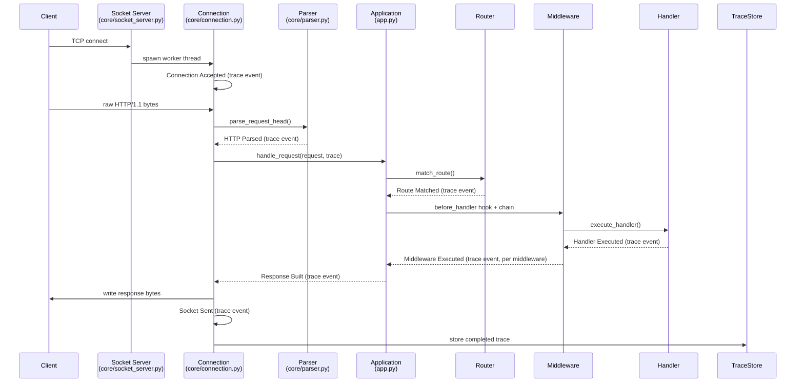

# Architecture

ExplainHTTP is a from-scratch HTTP/1.1 server. There is no framework
underneath it -- every layer between the raw TCP socket and the JSON response
your browser receives is implemented in `backend/`, using nothing but the
Python standard library.

## Design goals

1. **Explainability over cleverness.** Every architectural choice favors code
   that's easy to read top-to-bottom over one that's maximally fast or
   maximally abstract. This is a teaching tool as much as a server.
2. **Deterministic, no AI.** The trace/graph engine is plain instrumentation:
   timestamps, durations, and metadata recorded as the request actually
   moves through the pipeline. Nothing is inferred or generated.
3. **Extensible without modification.** The hook interface (`core/hooks.py`)
   lets behavior be added at each lifecycle stage -- logging, metrics,
   request/response mutation, fault injection for tests -- by registering a
   callable against a hook name, without editing the core pipeline code.

## Module layout

```
backend/
├── server.py            # CLI entrypoint
├── app.py                # Application: wires router + middleware + hooks + tracing + metrics + logging
├── routes.py              # Registers the demo API and explainability endpoints onto an Application
├── config.py              # Environment-driven configuration
├── core/
│   ├── socket_server.py   # Listening socket, accept loop, one thread per connection
│   ├── connection.py      # Per-connection framing: reads requests off the wire, writes responses
│   ├── parser.py          # Request-line/header parsing, chunked decoding (no socket I/O)
│   ├── request.py         # Parsed Request model
│   ├── response.py        # Response model + HTTP/1.1 wire-format serialization
│   ├── router.py          # Static + dynamic (<param>) route matching
│   ├── middleware.py       # Ordered middleware chain-of-responsibility
│   └── hooks.py            # before/after_request, before/after_handler, before/after_response
├── tracing/
│   ├── trace.py            # Trace, TraceEvent, TraceRecorder (the timing context manager)
│   └── trace_store.py      # Thread-safe, bounded in-memory trace storage
├── graph/
│   ├── graph_builder.py    # Trace -> node/edge ExecutionGraph
│   └── exporters.py        # ExecutionGraph -> graph.json / graph.dot / graph.cypher
├── logger/                 # Structured JSON logging (+ in-memory ring buffer for the Logs page)
├── metrics/                # Thread-safe runtime counters (latency, status/route counts, uptime)
└── handlers/                # Demo routes, static file serving, trace/graph/metrics/logs API
```

## Request lifecycle

Every request is assigned a trace ID the moment its connection is read, and
every pipeline stage records one `TraceEvent` (component, action, timestamp,
duration, status, metadata) onto that trace as it executes.



## Concurrency model

`SocketServer` accepts connections in a single loop and hands each one to its
own daemon thread (`threading.Thread`), which then owns that socket for its
entire keep-alive lifetime (`core/connection.py`). This is the simplest
concurrency model that is still genuinely concurrent, and it keeps the "how
does this actually work" story free of an event-loop's extra moving parts.
`TraceStore` and `Metrics` are the only state shared across threads; both
guard their internal dictionaries with a `threading.Lock`.

## Why hooks are separate from middleware

`core/middleware.py` is application-level and explicit: the app author
registers an ordered list of middleware (CORS, gzip compression, ...) and
every request runs through all of them, in order, wrapping the handler.

`core/hooks.py` is infrastructure-level and implicit: it exists purely as an
extension seam. ExplainHTTP itself registers zero hooks by default; any
extension can call `app.hooks.register("before_handler", some_callable)` and
have it fire on every request, with no changes to the core pipeline code.

## Execution graph

`graph/graph_builder.py` converts a `Trace` into a simple node/edge graph: one
`Request` node followed by one node per recorded event, connected by edges
labeled with the relationship between pipeline stages (`PARSED_BY`,
`ROUTED_TO`, `EXECUTED`, `RETURNED`, ...). `graph/exporters.py` renders that
graph three ways:

- **`graph.json`** -- for the dashboard's Graph Viewer (React Flow).
- **`graph.dot`** -- for Graphviz (`dot -Tsvg graph.dot -o graph.svg`).
- **`graph.cypher`** -- a `CREATE`-only Cypher script, directly importable
  into Neo4j (paste it into the Neo4j Browser or run it via `cypher-shell`).
